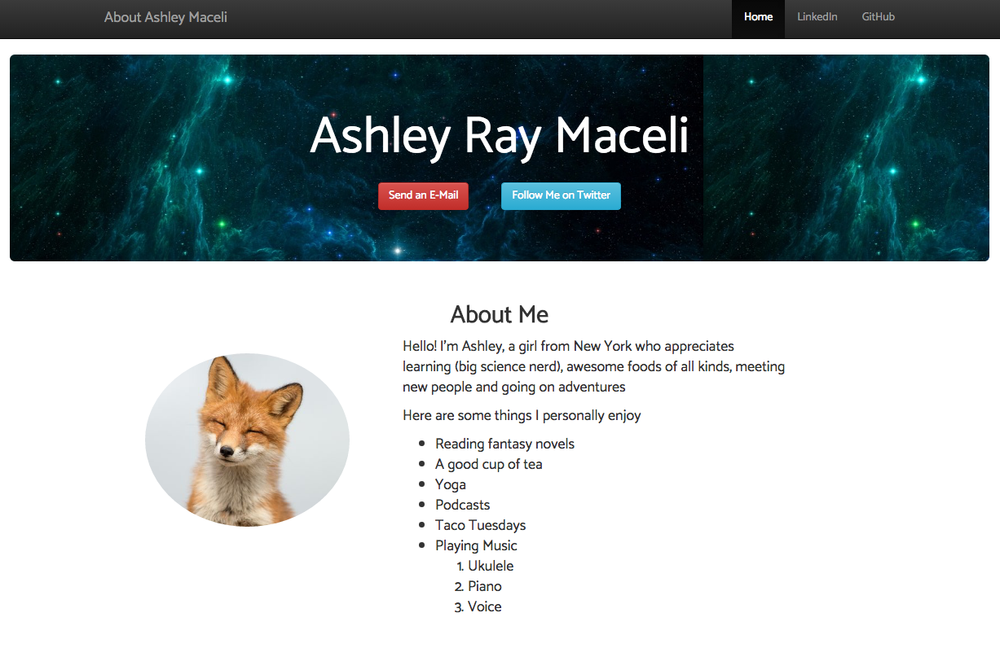
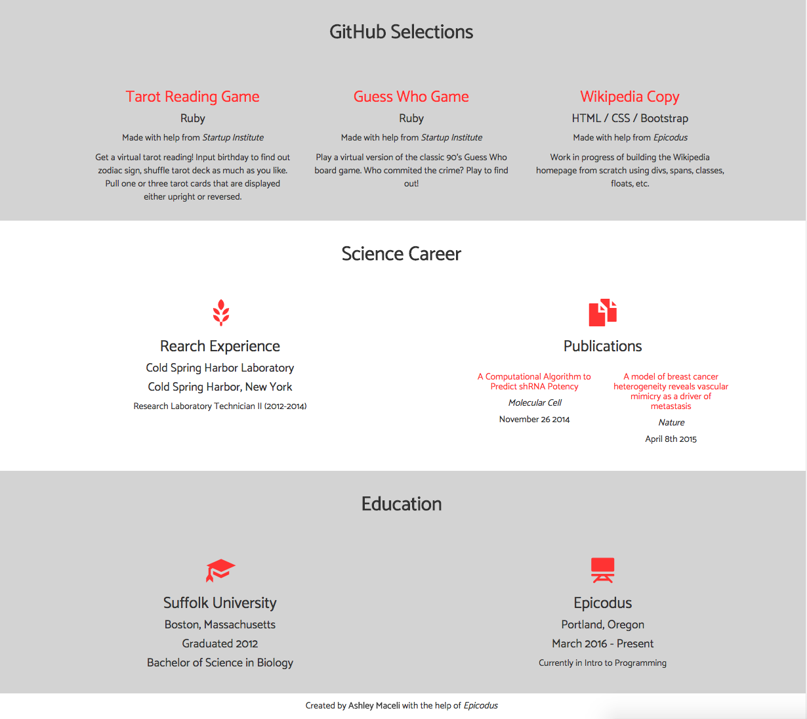

# _Portfolio Page_

#### _Portfolio page made with HTML, CSS and Bootstrap, Current version last edited: March 18th, 2016_

#### By _**Ashley Maceli**_

## Description

_Epicodus Intro to Programming Week 1 independent project. Created a webpage with information about the author. Meant to serve as a portfolio page._

##GitHub Pages Link

http://ashleyraymaceli.github.io/portfolio_

## Setup/Installation Requirements

* _Clone GitHub Repository https://github.com/AshleyRayMaceli/portfolio into your terminal_
* _Open index.html file in browser_

## Known Bugs

* _Dropdown menu added for smaller devices but no active links at the moment_

## Support and contact details

_Please contact Ashley via e-mail with issues_
_ashley.maceli@gmail.com_

## Technologies Used

_HTML, CSS, Bootstrap_

### License

_The MIT License (MIT)

Copyright (c) [2016] [Ashley Maceli]

Permission is hereby granted, free of charge, to any person obtaining a copy
of this software and associated documentation files (the "Software"), to deal
in the Software without restriction, including without limitation the rights
to use, copy, modify, merge, publish, distribute, sublicense, and/or sell
copies of the Software, and to permit persons to whom the Software is
furnished to do so, subject to the following conditions:

The above copyright notice and this permission notice shall be included in all
copies or substantial portions of the Software.

THE SOFTWARE IS PROVIDED "AS IS", WITHOUT WARRANTY OF ANY KIND, EXPRESS OR
IMPLIED, INCLUDING BUT NOT LIMITED TO THE WARRANTIES OF MERCHANTABILITY,
FITNESS FOR A PARTICULAR PURPOSE AND NONINFRINGEMENT. IN NO EVENT SHALL THE
AUTHORS OR COPYRIGHT HOLDERS BE LIABLE FOR ANY CLAIM, DAMAGES OR OTHER
LIABILITY, WHETHER IN AN ACTION OF CONTRACT, TORT OR OTHERWISE, ARISING FROM,
OUT OF OR IN CONNECTION WITH THE SOFTWARE OR THE USE OR OTHER DEALINGS IN THE
SOFTWARE.
